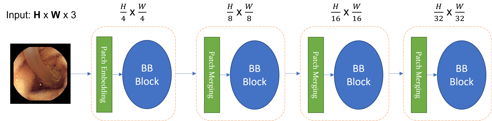
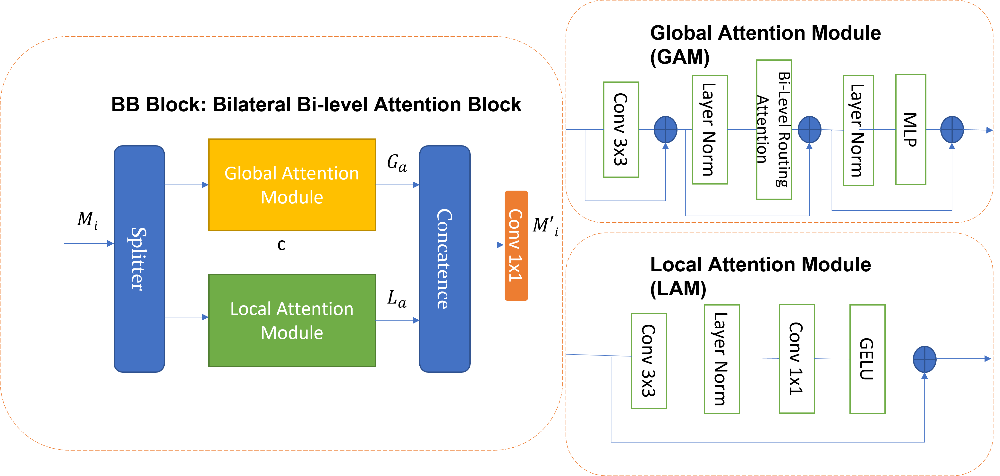

# BB-ViT: Bilateral Feature Network for Capsule Endoscopy Image Analysis

Capsule endoscopy (CE) has emerged as a prominent non-invasive diagnostic tool for gastrointestinal (GI) diseases. However, it generates massive amounts of data that require accurate and efficient analysis. Current state-of-the-art approaches in image classification tasks, such as the Vision Transformer (ViT), have shown impressive results but suffer from high computational complexity and a tendency to overlook local features.

In this repository, we introduce BB-ViT, a novel bilateral feature network designed to address these limitations, comprising a Global Attention Module (GAM) and a Local Attention Module (LAM). The LAM is responsible for extracting local features at multiple semantic scales, while the GAM employs bi-level routing attention to enable content-aware and computationally efficient allocation. By selectively attending to relevant regions without sacrificing local interactions, BB-ViT achieves superior performance with enhanced efficiency.

We evaluate our proposed model on the KvaSir-Capsule dataset, a public CE image repository, demonstrating that BB-ViT outperforms various baseline and state-of-the-art methods. Crucially, the reduced computational requirements of BB-ViT make it a practical solution for clinical settings, where access to extensive computational resources is often limited.

Our implementation is available at: https://github.com/zxcej/BB-ViT.

## Table of Contents
- [Installation](#installation)
- [Usage](#usage)
- [Results](#results)
- [Citation](#citation)
- [License](#license)

## Installation
TODO

## Usage
TODO

## Results
Here, we present the performance comparison of BB-ViT with various baseline and state-of-the-art methods on the KvaSir-Capsule dataset.

| Method       | Accuracy | Recall | F1-Score | Params | FLOPs |
|--------------|----------|--------|----------|--------|------|
| ...          | ...      | ...    | ...      | ...    | ...  |
| BB-ViT (Ours)| 0.7826   | 0.7815 | 0.8254   | 29.82M | 4.96 |

## Acknowledgements
This repository is built using the [timm](https://github.com/rwightman/pytorch-image-models) library,and [BiFormer](https://github.com/rayleizhu/BiFormer/)

